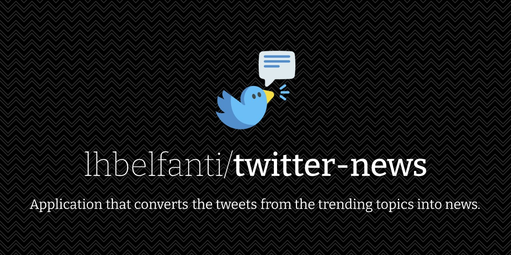

<div align="center">
  <picture>
    <source media="(prefers-color-scheme: dark)" srcset="media/twitter-news-dark.png">
    <source media="(prefers-color-scheme: light)" srcset="media/twitter-news-light.png">
    
  </picture>

  <br />

  
  
</div>

> **Warning**
> **08/01/2019**: This application is not working since the update of the Twitter UI. It needs to be adapted to support it.

## Client-Server

This application is divided in 2 parts:
- Client: the responsable of showing up the created news in a pretty way.
- Server: the responsable of gathering the necessary information to generate the news and then create them.


## How does it works? (the technical part)

The server uses **[Selenium](https://www.seleniumhq.org/)** to go through the trending topics of Twitter. Then, using web scrapping, it obtains all the information of each tweet of each trending topic. This information is processed, the hashtags, links and other relevant things are extracted to have a pure text that can be used to generate the news.
After the text analysis is done, the creation of the news starts. The text of the tweets of each trending topic are joined to create a big text that will be used as the base from where the program will create the news. Using the **[Markovify](https://github.com/jsvine/markovify)**'s implementation of **Markov Chains** and **[spaCy](https://spacy.io/)** a **N**atural **L**anguage **P**rocessing software, sentences are created and putted together to form the news.
Finally, a JSON file is created with the news of each trending topic.

The client gets the JSON and using [React](https://reactjs.org/) with [Semantic UI](https://react.semantic-ui.com/) it shows the news in a web page in a _pretty_ way.

## Configuring the application before start using it

After download the application you have to install the necessaries things to run it.

For the Client:
1. Install Node JS
2. **Inside the client folder** run: `npm install`

For the Server:
1. Download the chrome driver from [here](https://sites.google.com/a/chromium.org/chromedriver/downloads) and set an environment variable for it
2. Install Python 3
3. Install [pip](https://pypi.org/project/pip/) (probably it's already installed because of the instalation of Python)
4. Install virtualenv: `pip install virtualenv`
5. **Go into the _server_ folder of the project** and run:
- `virtualenv venv`
- `source venv/bin/activate`
6. Install the necessary dependencies running: `pip install -r requirements.txt`


## How to use the app

**Requirement**: A Twitter account

Server:
To run the server go into the _src_ folder inside the _server_ folder and run

```python
python3 start.py username password
```
> **Note:** The **username** and the **password** are the username (or mail) and password of the Twitter account.

Client:
To run the client go to the _client_ folder and run
```javascript
npm start
```
> **Note:** Should not be necessary to manually run it. The client is automatically called after the server finishes its work.

---
## License

[MIT](https://choosealicense.com/licenses/mit/)